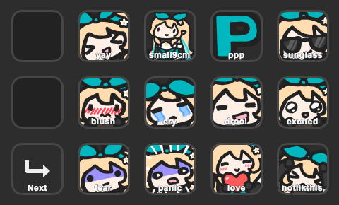
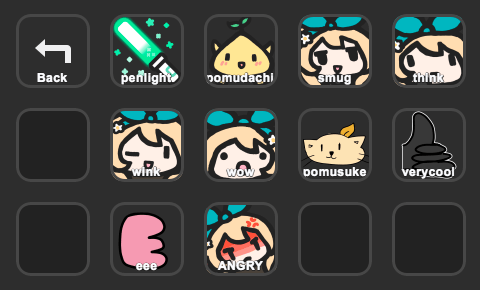

# streamdeck-youtube-emotes

CLI tool to generate Stream Deck profiles for YouTube membership emotes.

## Download

Visit the [releases page](https://github.com/walfie/streamdeck-youtube-emotes/releases)
to find the latest release for your platform.

## Build

The following command creates an executable at `./target/release/streamdeck-youtube-emotes`

```sh
cargo build --release
```

## Example

The program extracts the list of emotes from the `ytInitialData` variable
defined in the HTML of a channel's membership page. E.g.,

<https://www.youtube.com/channel/UCP4nMSTdwU1KqYWu3UH5DHQ/membership>

Unfortunately the emote data is only available when you're logged in, so the
download must be done through your browser. If you download the file in Chrome,
make sure to select "Webpage, HTML Only" as the format when saving (to avoid
any additional postprocessing of the HTML file).

Assuming you've saved the HTML to a file `/tmp/pomu.html` and have a standard
15-key Stream Deck, you can run the following:

```sh
streamdeck-youtube-emotes \
  --name "Pomu Emotes" \
  --prefix pomu \
  --include-labels \
  --model standard \
  --prioritize yay small9cm \
  --deprioritize verycool eee ANGRY \
  --html-file /tmp/pomu.html \
  --restart
```

This command will:

* Generate a Stream Deck profile named "Pomu Emotes"
  * The prefix will be `pomu`, so pressing the key for the `small9cm` emote
    will input `:_pomuSmall9cm:`
  * Each emote key will have a label with the name of the emote below it
  * The `yay` and `small9cm` emotes will be moved to the beginning of the list
  * The `verycool`, `eee`, and `ANGRY` emotes will be moved the end
* Save it to the default profiles directory on your platform
  (E.g., `"$HOME/Library/Application Support/com.elgato.StreamDeck/ProfilesV2/"`
  on macOS)
* Restart the Stream Deck application so that the changes are picked up

The UUID of the profile is based on the `--name` param, so if you re-run the
command with different options but with the same name, it will save to the same
profile.

### Screenshots

Here is an example of a profile with two pages of emotes, generated with the
command above, using [Pomu Rainpuff's membership page][Pomu] as input.

* Page 1

  

* Page 2

  

The generated profile will have one column of reserved space on the left, which
will be occupied by the next/previous buttons (in cases where the channel has
more emotes than can fit on a single page).

Other empty spaces can be filled via the Stream Deck UI, so you can have custom
keys for switching profiles, etc. These empty spaces will not be overwritten
when generating the profile again (unless the `--no-merge` flag is set)

[Pomu]: https://www.youtube.com/channel/UCP4nMSTdwU1KqYWu3UH5DHQ/membership

## Usage

The full list of options can be found below:

```
USAGE:
    streamdeck-youtube-emotes [FLAGS] [OPTIONS] --html-file <html-file> --model <model> --name <name>

FLAGS:
    -h, --help
            Prints help information

        --include-labels
            Whether to include the name of the emote on each key

        --no-merge
            Overwrite existing manifest files instead of merging them

        --restart
            Restart the Stream Deck application after creating the profile

    -V, --version
            Prints version information


OPTIONS:
        --deprioritize <deprioritize>...
            List of emotes that should appear last, after all others (case-insensitive)

        --device-uuid <device-uuid>
            Device UUID for the Stream Deck [default: ]

        --html-file <html-file>
            Path to an HTML file containing the memberships page for a channel. E.g., Download the following page in a
            browser while logged in: https://www.youtube.com/channel/UCP4nMSTdwU1KqYWu3UH5DHQ/memberships

            Use - to read from stdin.
        --model <model>
            The Stream Deck model to generate the profile for [possible values: standard, xl, mini]

        --name <name>
            Name of the Stream Deck profile. Note that if the `profile-uuid` argument is unspecified, this name will be
            used to determine the name of the output profile directory
        --out <out>
            Output path to save the profile to. If unspecified, profiles will be saved to the default Stream Deck
            profile location (depending on platform)
        --prefix <prefix>
            The emote prefix (also known as "family name"). For example, if the channel has an emote `:_pomuSmall9cm:`,
            the emote prefix would be `pomu`. For some channels, there is no prefix, so this option can be omitted
            [default: ]
        --prioritize <prioritize>...
            List of emotes that should appear first, before all others (case-insensitive)

        --profile-uuid <profile-uuid>
            Override the UUID for the profile

```

